# Exporting AST data in bulk

Below are instructions for exporting data off common AST platforms, including:

- [Vitek2 – BioMérieux](#vitek2--bioméri­eux) (courtesy of Sarah Baines, Uni of Melbourne)
- [Sensititre – Thermo Fisher](#sensititre--thermo-fisher) (courtesy of Sarah Baines, Uni of Melbourne)

## Vitek2 – BioMérieux

*Compatible with Vitek2 System Software release version 9.*

Long term data storage must be enabled on the platform for bulk data exporting.

### Step 1. Log in

Log in to the Vitek2 system using your account details.

### Step 2. Open the Vitek2 Systems software

Open the Vitek2 Systems software utility on the computer linked to your Vitek2 platform.

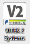

### Step 3. Navigate to the bulk data export tool

From the main page of the Vitek2 Systems software, select the tools option (toolbox icon).

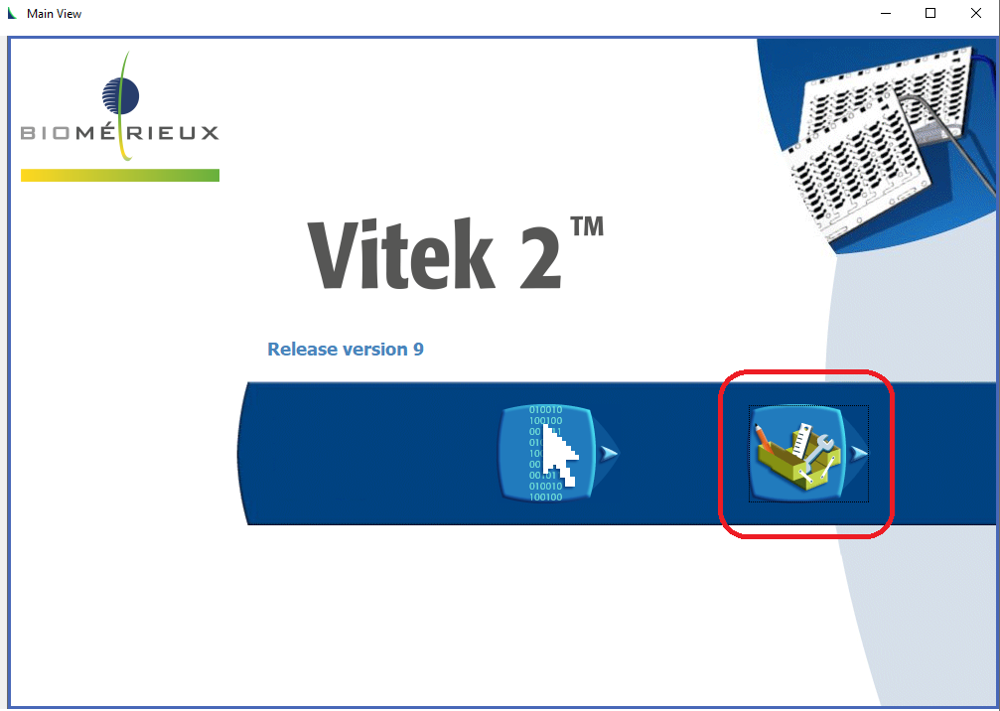

From the drop-down menu select "Export Inactive Isolates".

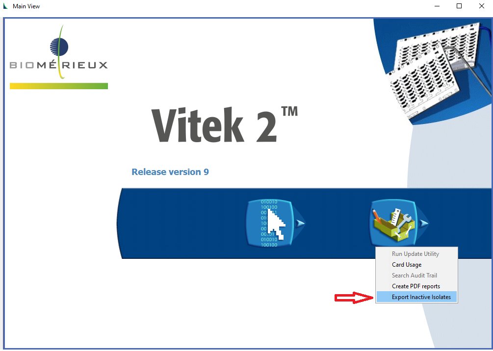

> **Note:** In older versions of the Vitek2 Systems software, the main page has additional options. However, the following steps remain the same for bulk data export.

### Step 4. Configure the export

Use the available options to configure what data you want to export. Required details include the test type (Isolate or QC), date range, and data types to export.

All other filters are optional. If left blank, all values will be kept in the export.

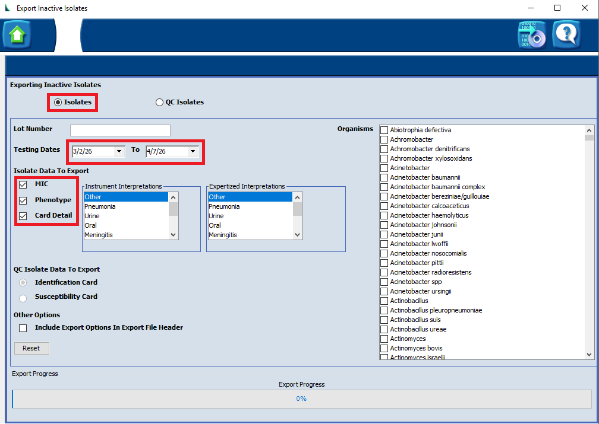

> **Note:** If manually entering the date range (instead of using the drop-down calendar), check the data format before proceeding with the export. For example, the data format in the image above is MM/DD/YYYY not DD/MM/YYYY.
>
> Date is based on when a test was started (e.g., when the card was loaded into the platform).

### Step 5. Run export

Once all configurations are set, select the disk icon in the top right corner to start the export.

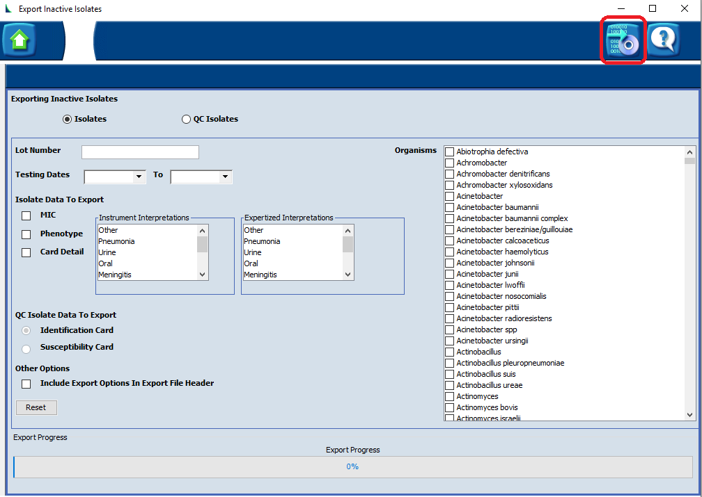

A screen will pop up to indicate how many records were found.

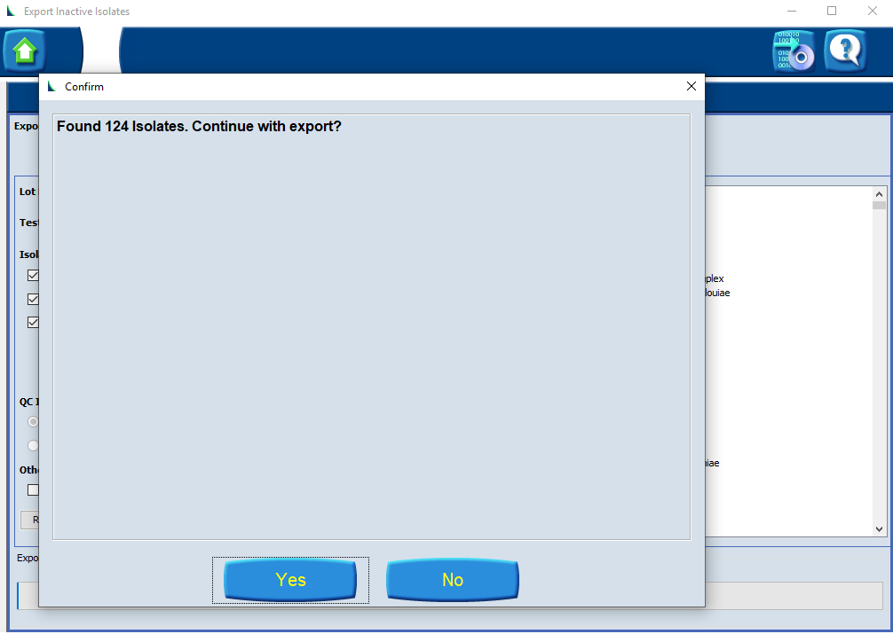

If this number is correct, select **Yes** to proceed with export. A further window will appear in which you can name your export file and select a save location.

If the number is incorrect, select **No** to return to the configuration page.

### Step 6. Find your export file

Navigate to the destination location you specified when saving the file. This file is a comma separated file (csv) and can be imported into other software (such as Excel) to view.

> **Note:** Large exports may take several minutes to complete. You will receive a notification when the export is complete.

### Troubleshooting — why is my data not in the bulk export?

There are many reasons why data may not appear in the bulk export file. Some of the most common issues are explained below. If you cannot resolve your export issues with the details below, consult with your local BioMérieux representative.

1. **Check your export configuration setting**

   Repeat the steps above to configure a bulk data export. At the stage of confirming your export (step 5), check that the expected number of samples has been identified.

   A common issue with export configuration is setting the date range correctly. Check the date range format (i.e., DD/MM/YYYY versus MM/DD/YYYY). Ensure the date range covers the day in which the sample test was commenced — the day the card was loaded into the platform.

2. **Check the data record is complete** (as incomplete records are not transferred to inactive data, and will not appear in bulk data exports)

   Only complete data records are transferred from active to inactive data, and only inactive data can be bulk exported. To check if your data record is complete, open your MYLA software and look at the 'Isolate status'. Only records with an 'Approved' status (a full green box) are transferred to inactive data.

   If the 'Isolate status' is any other value, review the status type to identify why the record is not 'Approved'.

   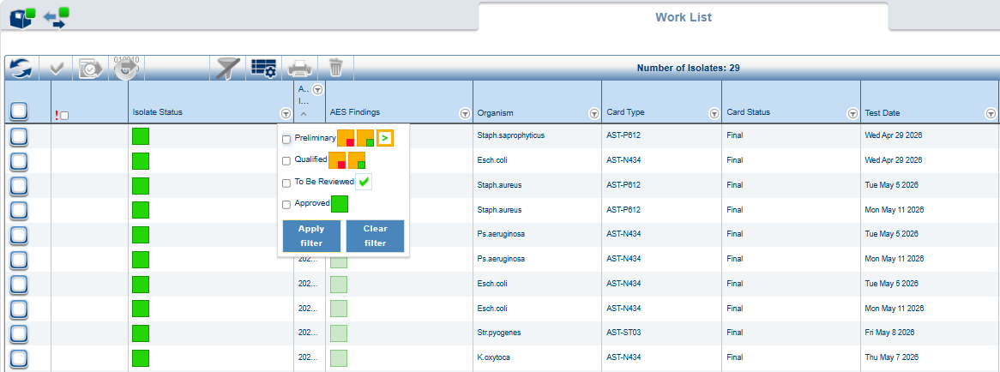

3. **If your 'Isolate status' is 'Approved' but the data record is still not present in your bulk data export**, check the data transfer (active to inactive) timeframes configured in your systems settings.

   The time between when a test is started (card loaded into the platform) and when that data record is moved from active to inactive data is set within the system configuration settings. This could be between 3 and 30 days. A data record **must** be approved within this timeframe for the data record to be moved to inactive data. You can check this setting in the Vitek2 Systems software.

   Resolving this issue depends on where your data record currently is within the configured timeframes.

   If the date of the bulk export is within the configured active-to-inactive data transfer timeframe from when the test was started (and if the 'Isolate status' is 'Approved'), you will need to wait until the configured time has passed before you can include it in the bulk export.

   *Example: if your active-to-inactive data transfer timeframe is set as 7 days, and you are currently on day 5 after starting the test, you will need to wait until day 8 to include the data record in the bulk export.*

   If the date of the bulk export is beyond the configured active-to-inactive data transfer timeframe (e.g., day 8 or greater from the example above), then something has prevented the data record moving to inactive data. Commonly, the Isolate status has not moved to 'Approved' within the transfer timeframe.

   > **Note:** A data record cannot be moved to inactive data after the active-to-inactive transfer timeframe has passed. If you have such records (held up due to Isolate status or other issues), you will need to export the individual sample results to capture this data.

---

## Sensititre – Thermo Fisher

*Compatible with Sensititre SWIN software release version 3.4.*

### Step 1. Log in

Log in to the Sensititre system using your account details.

### Step 2. Open the SWIN Software

Open the SWIN software utility on the computer linked to your Sensititre platform.

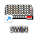

### Step 3. Navigate to the results section

From the main page of the SWIN software, select the Reports icon (paper with green tick icon).

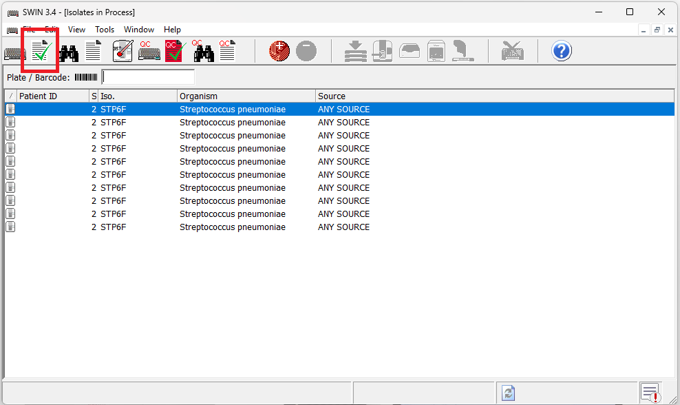

### Step 4. Configure the export

In the results section, select the search option "Isolates Read Between" and specify a date range.

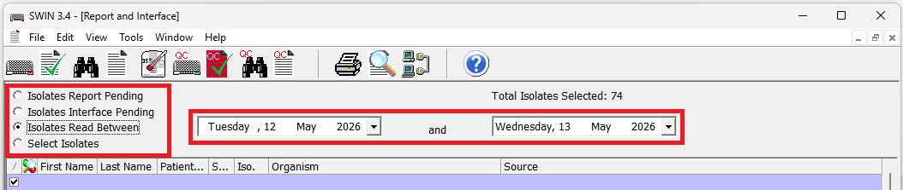

> **Note:** Other search options include:
>
> - *Isolates Report Pending* — will export only results not yet reported.
> - *Isolates Interface Pending* — will export only results waiting to be interfaced.
> - *Select Isolates* — will export only isolates selected manually.

Check the data records identified and select or un-select isolates to configure an export list.

### Step 5. Run export

Once all configurations are set, select the 'Export' option to start the export.

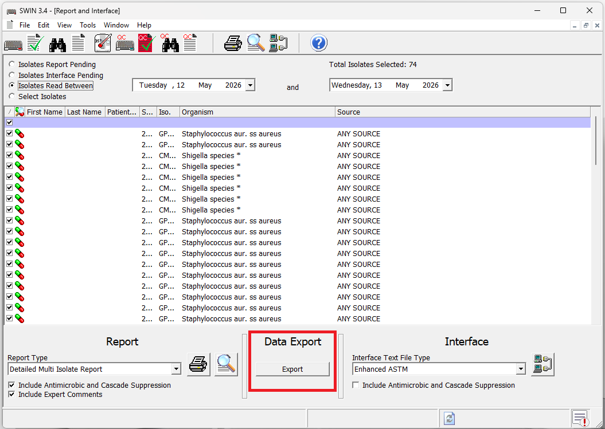

A pop-up notification will appear once the export is complete.

### Step 6. Find your export file

An export location is configured within the SWIN software. Navigate to this destination location to find your file.

The file will have the following naming convention: `SWINExportFile_YYYYMMDD_HHMMSS.txt`

This file is a tab separated file (tsv) and can be imported into other software (such as Excel) to view.

> **Note:** You can check your export location by navigating to Options > Data Export in SWIN.
